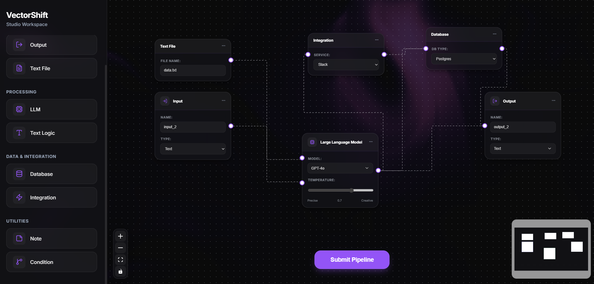

# VectorShift Studio

A high-fidelity pipeline editor built with ReactFlow and FastAPI.



## Project Structure

```
vector-shift/
├── frontend/             # React application
│   ├── src/
│   │   ├── nodes/       # Custom ReactFlow nodes
│   │   ├── store.js     # Zustand state management
│   │   └── ui.js        # Main canvas component
│   └── package.json
├── backend/              # FastAPI server
│   ├── main.py          # API logic & DAG validation
│   └── requirements.txt # Python dependencies
└── .gitignore
```

## Features

- **Interactive Canvas**: Drag-and-drop nodes, create connections, and manage complex pipelines.
- **Advanced Nodes**: Includes LLM, Database, Integration, and Logic nodes with professional dark-mode styling.
- **DAG Validation**: Integrated backend service to verify pipeline integrity using Kahn's algorithm.
- **Node Actions**: Duplicate, Delete, and Edit functionality per node.
- **Deep Space Theme**: Glassmorphic UI with high-contrast elements and interactive backgrounds.


## Getting Started

### Backend
1. `cd backend`
2. `pip install -r requirements.txt`
3. `uvicorn main:app --reload`

### Frontend
1. `cd frontend`
2. `npm install`
3. `npm start`

## Deployment

### 1. Backend (Render)
Render is ideal for FastAPI. It will automatically detect the `requirements.txt`.

1. **New Web Service**: Connect your GitHub repository.
2. **Build Command**: `pip install -r requirements.txt`
3. **Start Command**: `python -m uvicorn main:app --host 0.0.0.0 --port $PORT`
4. **Root Directory**: `backend` (Set this in the "Advanced" settings on Render).

### 2. Frontend (Vercel)
Vercel is optimized for React. 

1. **New Project**: Import your repository.
2. **Framework Preset**: Select "Create React App".
3. **Root Directory**: `frontend`
4. **Environment Variables**: Add `REACT_APP_BACKEND_URL` pointing to your Render service URL.
5. **Update Fetch URL**: Ensure `submit.js` and other files use your deployed URL instead of `localhost:8000`.
